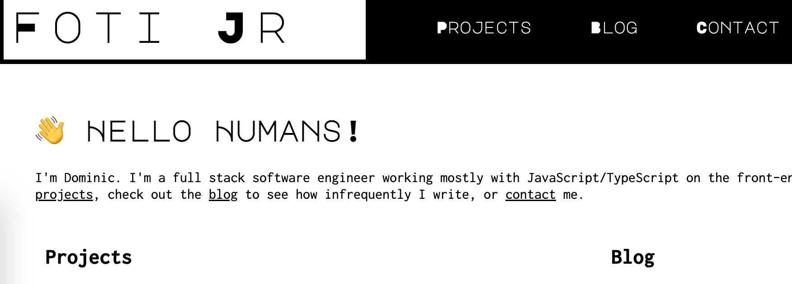

# fotijr.com 
My personal site. Built with [vuepress](https://vuepress.vuejs.org/) and continuously deployed by [Netlify](https://www.netlify.com/). More details [here](https://fotijr.com/blog/2020/how-its-made/).

## Adding a blog post
Under `src/blog`, create a directory and `readme.md` for the new post.