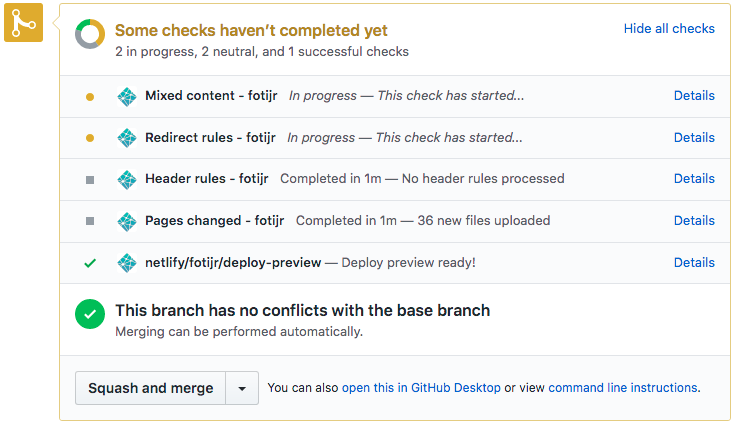

It has been years since I've updated my personal site in any way. My previous setup was a static site and blog built locally using [Jekyll](https://jekyllrb.com/), then FTP'ed to the web server. Jekyll runs on Ruby, which is an ecosystem I otherwise don't happen to work with. 

I finally took on the task of rebuilding my site. My goals for the site rebuild were:
- **Open source**- I wanted to have the source code for my site publicly available on GitHub. This would help increase my portfolio, which is fairly small since most of my work is for businesses and not open source. But the biggest motivation for open sourcing the site is to make it easier for others to start their own site with a static site builder already setup and configured.
- **Node based**- I wanted the site build tools to be on Node.js, since that's a platform I'm already using daily and stay current on.
- **CI/CD**- Continuous integration and deployment takes the risk and fear out of the development process. Ideally I would be able to deploy from GitHub, which would give me greater flexibility in what location or device I use to update the site.

There are a lot of tools available that meet my modest requirements. I went with the below approach, but just know there are many ways to solve what I was trying to accomplish.

## Architecture
### Vuepress
I chose Vuepress for the static site builder. It's node-based, which fits in perfectly with my current environment. Vuepress is maintained by the Vue core team, which gives me enough confidence in long-term support. I had also just build [navo.io](https://navo.io) using Vuepress, so I wasn't concerned about any learning curve or customization.

Alternates evaluated: [Nuxt](https://nuxtjs.org/), [Hugo](https://gohugo.io/)

### GitHub
The source code repository for this site is hosted on [GitHub](https://github.com/fotijr/fotijr.com). GitHub is where my public projects happen to be, although I also use GitLab and Azure DevOps for private projects.

Alternates evaluated: [GitLab](https://about.gitlab.com/), [Azure DevOps](https://azure.microsoft.com/en-us/services/devops/repos/)

### Netlify
The site is built and hosted on [Netlify](https://www.netlify.com/). Netlify is one of those tools that feels very fun to start using. It's simple to configure, and the features included with a free account are truly impressive. When I want to add a blog post or make a change to any site content, I create a new branch and make my changes. When I'm finished, I push my branch and open a PR. When the PR is opened, Netlify builds the site and deploys a preview version! The builds are insanely fast, and the preview site takes away all the stress over worrying about how new changes will look.

This preview site link is generated with each PR so in addition to automated code checks like builds and unit tests, a visual verification can happen without having to build and serve the site locally. Updates and deployments are now stress-free 🙌

Alternates evaluated: Self-hosted

