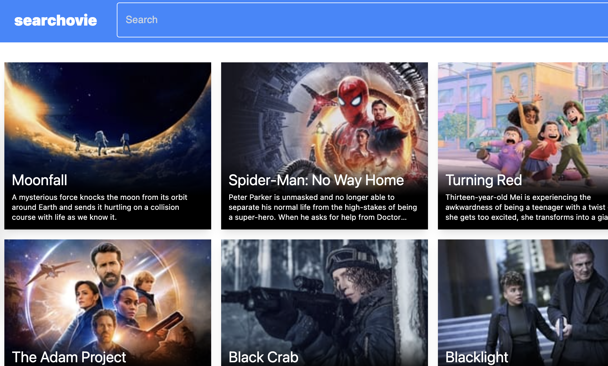
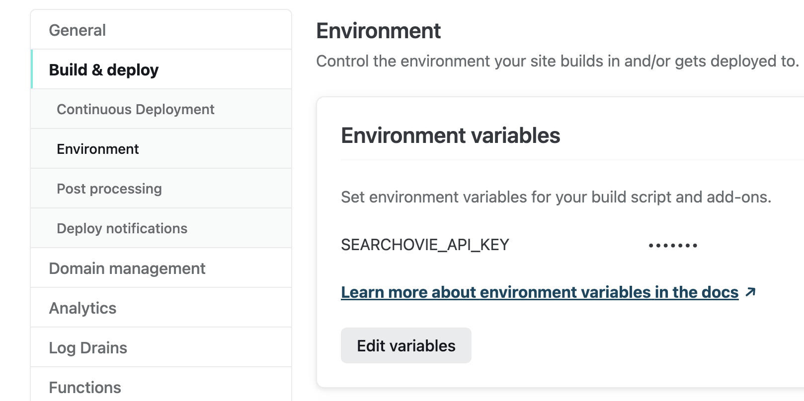
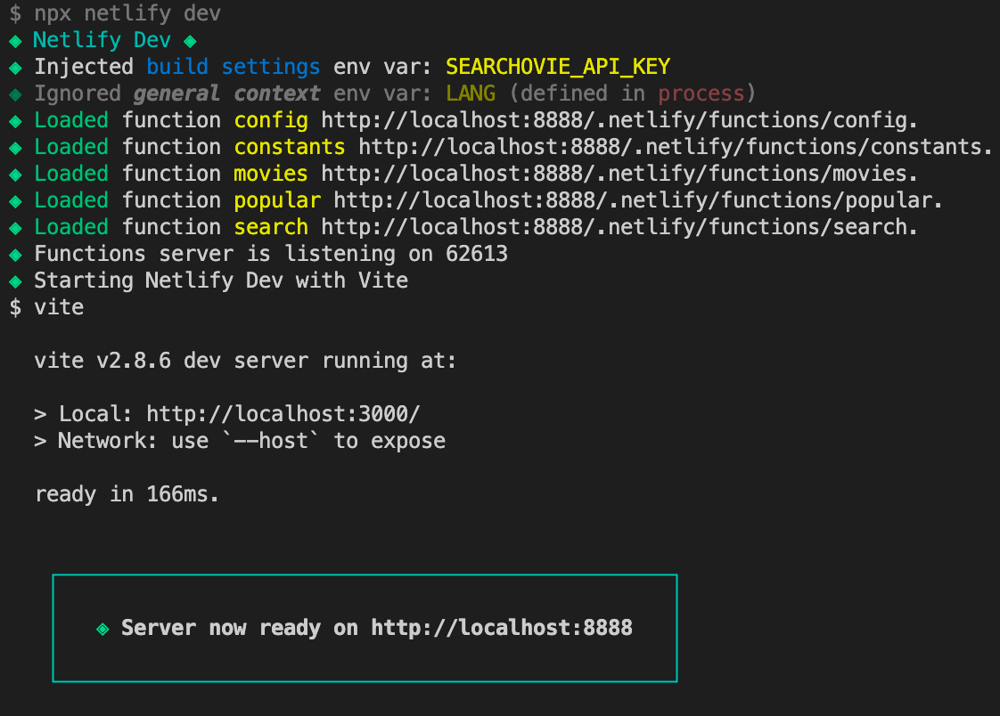

I built [Searchovie](https://searchovie.fotijr.com/), a web app for searching movies ([source](https://github.com/fotijr/searchovie)). It's a React app written in TypeScript. Styling is done with Tailwind CSS, and the data source is [The Movie DB's API](https://developers.themoviedb.org/3/movies/get-popular-movies).

## Background
Recently I needed some back-end functionality on a deployed project. I had two requirements: I didn't want to self-host, and my budget was $0 (USD). All I needed were a few endpoints, so serverless functions already seemed like a great fit. I checked Netlify since I've had a great experience with them for hosting & deployment, and serverless functions are included in their [free tier](https://www.netlify.com/pricing/)! To get familiar with Netlify Functions, I built Searchovie- a React app that shows movie search results using The Movie DB's API.

## Development
I built the front-end with React, TypeScript, and Tailwind CSS. For auto-complete functionality, I used [Mui's Autocomplete](https://mui.com/components/autocomplete/) component. I found it a little clumsy to style the component. It looks like Mui's theming system is fairly robust, but a bit overkill when you just need to style one component.

When it was time to write the server functions, I created JavaScript files under [./netlify/functions](https://github.com/fotijr/searchovie/tree/main/netlify/functions). I was skeptical of how the local development flow would work, but the [Netlify CLI](https://docs.netlify.com/cli/get-started/) made it seamless. Using the CLI, the functions behave identical when running locally compared with running deployed. I did run into one limitation when trying to modify my API URL syntax. I wanted to group functions under sub-directories so the resulting URL would look more REST, but nested directiories with function files [isn't supported](https://github.com/netlify/netlify-lambda/issues/90#issuecomment-450076519) by Netlify.

### Secrets, secrets...
The Movie DB's API requires an API token, which is tied to a developer account and can't be exposed. When doing initial integration, I created a local [environment variable](https://github.com/fotijr/searchovie/blob/main/netlify/functions/constants.ts#L2) to store this. As I refactored things in getting ready for deployment, I added this variable to Netlify's environment. This was my first time using Netlify's build environment variables, but the process was simple.

The CLI even made the environment variable accessible when running locally! See the "Injected build settings" line printed to the terminal when the dev server starts up:

### All in all

Most functionality was working well, so I was fairly pleased. My only disappointment was in having to switch from TS to JS when jumping between front-end and back-end code. Eventually I googled it to see what my options were, and I found that native TS support was added to Netlify Functions [last year](https://www.netlify.com/blog/2021/04/19/announcing-native-typescript-support-for-netlify-functions/)! Converting to TS was trivial, and immediately I had type checking 🙌

Overall, using Netlify Functions was a smooth and enjoyable developer experience. It's a great free resource that I'm sure to use again.

[🔍 Try out Searchovie](https://searchovie.fotijr.com/)

[💻 Go to the source code](https://github.com/fotijr/searchovie)