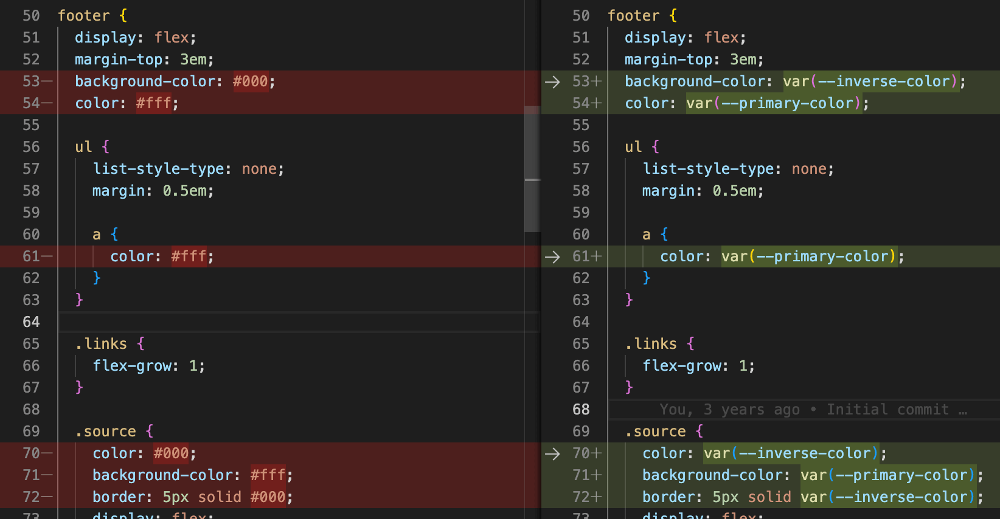
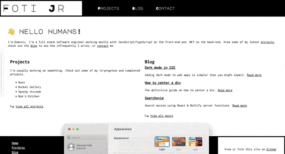

Adding dark mode support to websites has become incredibly simple. Plenty of guides and walk-throughs have been written on the topic, so I'm not covering new ground here (I especially appreciated [this guide](https://css-tricks.com/a-complete-guide-to-dark-mode-on-the-web) by [Adhuham](https://adhuham.com/)). It only took me a few minutes, but I still wanted to document my steps here.

## Considerations
Dark mode support should be a consideration at the design stage of most products today. It may be a backlog item for awhile, but it needs to be at least in the back of designers' & developers' minds when building a product.

When coming up with the initial design for my site, I didn't want to spend much time picking colors and finding the right contrasts for accessibility. I went with just black and white colors and simple fonts, with the hopes that the design would reflect the technical nature of the content. This overly simple color usage made adding theme support incredibly simple. This likely won't be the case for most sites, but it's something to consider when deciding on a color pallette.

## It's getting dark in here
The first step to enabling theme toggling was to set the [color-scheme](https://developer.mozilla.org/en-US/docs/Web/CSS/color-scheme) in my site's styles, and that got me way farther than I expected!

```css
:root {
  color-scheme: light dark;
}
```

It's also good to add the `color-scheme` meta tag to your site's `<head>` to tell the browser what themes are available. Since I use Vuepress to build this site, I added this to my site theme's [config.js file](https://github.com/fotijr/fotijr.com/blob/main/src/.vuepress/config.js).


With just that `color-scheme` CSS change, every element's color that I didn't explicitly set in CSS did what it _should_ do when going from light mode to dark mode. The next step was to get the color values that I did specify in CSS correctly updated when toggling light/dark theme. I didn't want to go with the `class="dark"` approach on the body, since that requires more verbose stylesheets. With [CSS variable browser support](https://caniuse.com/css-variables) being so great now, going with a pure CSS approach was the obvious choice and most performant (since it requires no JavaScript).

## CSS variables
All I needed were two variables since this site is just black and white. Naming color variables that have dynamic values can be difficult, but I went with `primary-color` and `inverse-color`. When in light mode, `primary-color` is white (`#fff`) and in dark mode `primary-color` is black (`#000`). The default style is the light theme.

```css
:root {
  color-scheme: light dark;
  --primary-color: #fff;
  --inverse-color: #000;
}
```

When the user has an operating system currently in dark mode, those default values are updated. This is done through the [`prefers-color-scheme` media query](https://developer.mozilla.org/en-US/docs/Web/CSS/@media/prefers-color-scheme).

```css
@media (prefers-color-scheme: dark) {
  :root {
    --primary-color: #000;
    --inverse-color: #fff;
  }
}
```

Once the CSS variable values were being set correctly, it was just a matter of updating styles to use them instead of hard-coded color values.



## Ship it
Adding this feature to my site was the software engineer's dream scenario that rarely happens: a few lines of code and everything just works.




